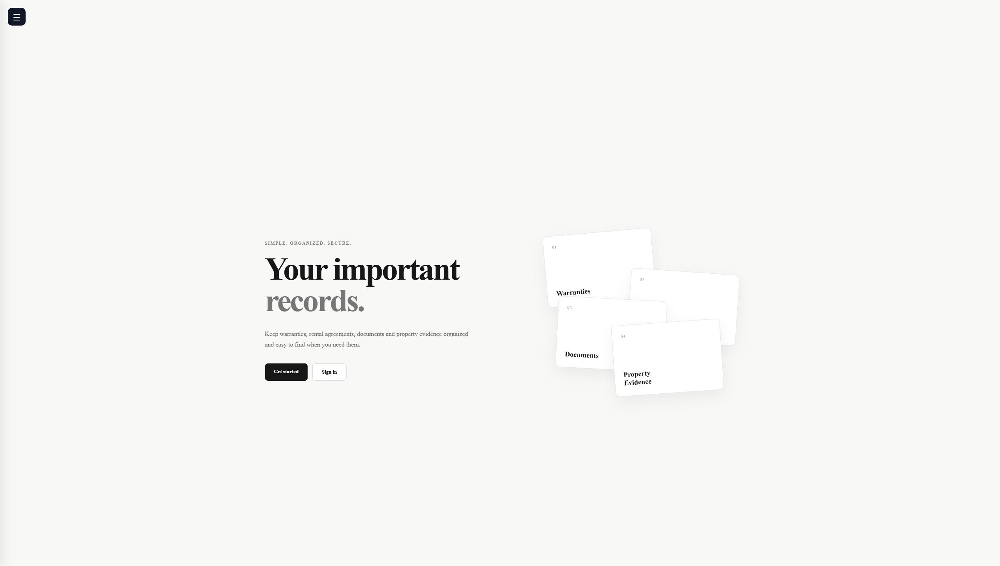
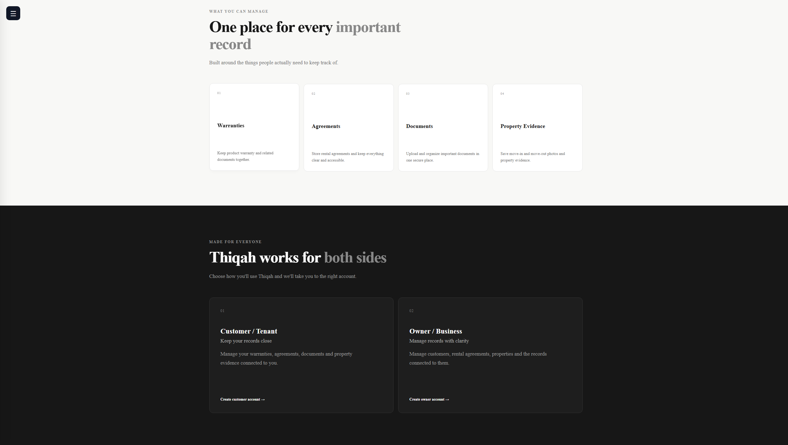
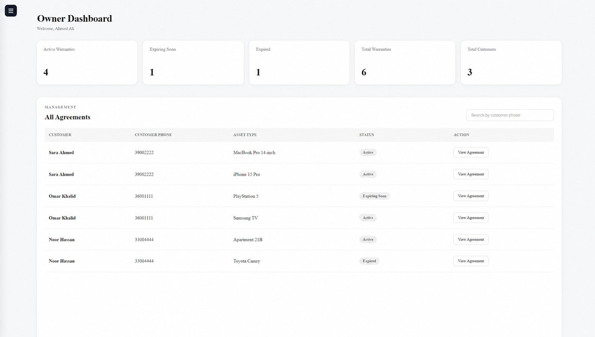
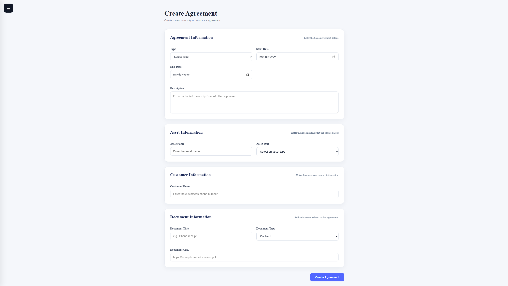
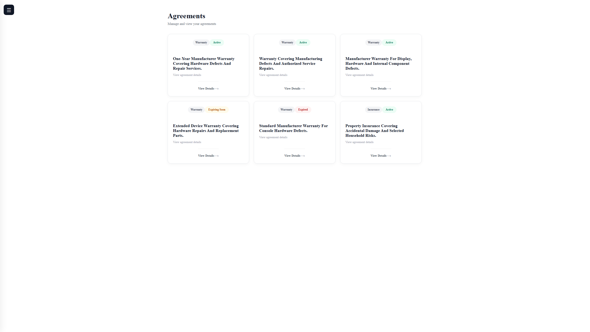
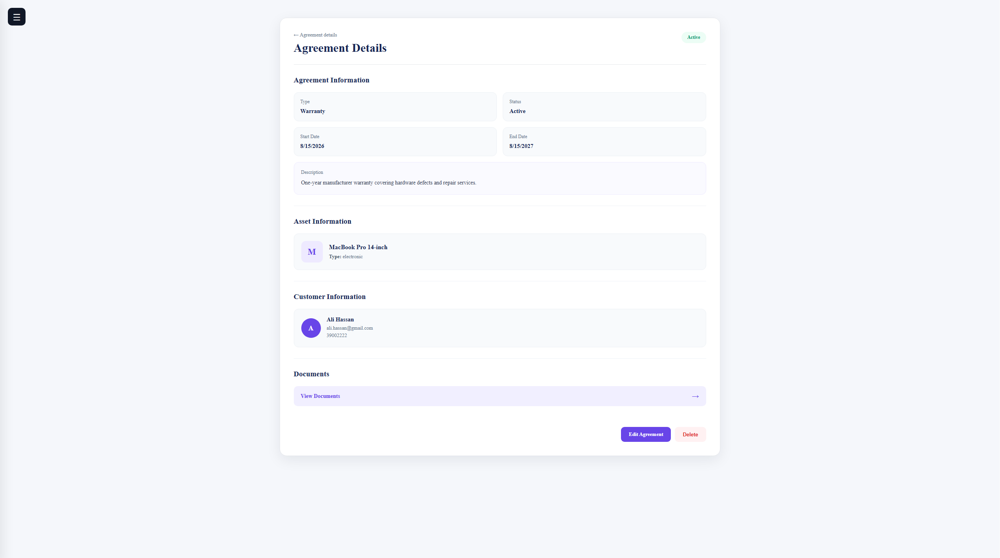
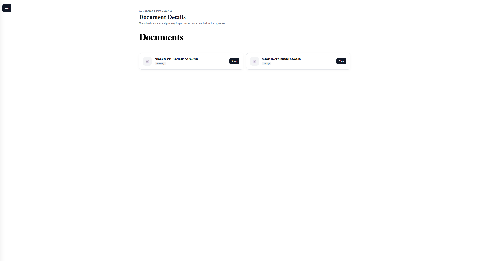
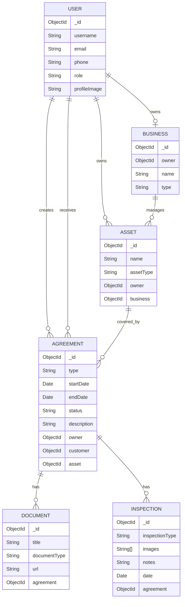

# Thiqah

**Your important records. All in one place.**

Thiqah is a full-stack MERN application that helps customers, tenants, owners, and businesses organize warranties, rental agreements, documents, assets, and property-inspection evidence in one secure place.

The application gives each user a focused experience: customers can access records connected to them, owners can create and manage agreements for their customers, and administrators can manage users and businesses.

## Links

- [Frontend repository](https://github.com/HusainAlmajed/Project-4-FrontEnd)
- [Backend repository](https://github.com/HusainAlmajed/Project-4-BackEnd)

<!-- Add the deployed application link here when deployment is complete. -->

## Screenshots

### Home page



### What users can manage



### Owner dashboard

Owners can review agreement statistics, search by customer phone number, and open agreements connected to their account.



### Create an agreement

An owner can create an agreement together with its asset, customer, and document information.



### Agreements

Agreement cards clearly show the agreement type and its current status.



### Agreement details

Customers can view the business connected to an agreement, its dates, covered asset, status, and related documents.



### Documents

Documents and receipts connected to an agreement are kept together and can be opened directly from the application.



## Features

### Authentication and accounts

- Customer and owner registration
- Secure sign-in using JSON Web Tokens
- Customer, owner, and administrator account roles
- View and edit profile information
- Upload a profile image using Cloudinary
- Friendly 404 page for unknown routes

### Customer experience

- View only agreements connected to the signed-in customer
- Review agreement status, dates, asset, and business information
- Open documents connected to an agreement
- Manage personal profile information

### Owner experience

- View only agreements connected to the signed-in owner
- See active, expiring, and expired agreement totals
- Search agreements using a customer's phone number
- Create agreements for registered customers
- Add asset and document information while creating an agreement
- Edit and delete agreements
- Add property-inspection information for property agreements

### Documents and property inspections

- Add, view, edit, and delete agreement documents
- Open document URLs in a new browser tab
- Create before-and-after property inspections
- Upload and preview inspection images using Cloudinary
- Save inspection notes and dates

### Administrator experience

- View registered users and businesses
- Change user roles
- Delete users
- Delete businesses

## How It Works

1. A customer or owner creates an account and signs in.
2. An owner creates an agreement for a registered customer using the customer's phone number.
3. The agreement stores its dates, description, asset, and supporting document.
4. Thiqah calculates whether the agreement is active, expiring soon, or expired.
5. Both sides can access the agreement through their own account.
6. Property agreements can also include inspection notes and images.

## Technologies Used

### Frontend

- React
- React Router
- JavaScript
- HTML5
- CSS3
- Vite
- ESLint
- Cloudinary Upload Widget

### Backend

- Node.js
- Express
- MongoDB
- Mongoose
- JSON Web Tokens
- bcrypt

## ERD



## Getting Started

### Prerequisites

- Node.js
- npm
- MongoDB connection for the backend
- A running copy of the [Thiqah backend](https://github.com/HusainAlmajed/Project-4-BackEnd)

### Installation

1. Clone the frontend repository:

   ```bash
   git clone https://github.com/HusainAlmajed/Project-4-FrontEnd.git
   ```

2. Move into the project directory:

   ```bash
   cd Project-4-FrontEnd
   ```

3. Install the dependencies:

   ```bash
   npm install
   ```

4. Create a `.env` file in the project root:

   ```env
   VITE_BACK_END_SERVER_URL=http://localhost:3000
   ```

5. Start the development server:

   ```bash
   npm run dev
   ```

6. Open the local URL shown by Vite in your browser.

### Available Scripts

```bash
npm run dev      # Start the development server
npm run build    # Create a production build
npm run lint     # Check the code with ESLint
npm run preview  # Preview the production build
```

## Project Structure

```text
src/
├── assets/
├── components/
│   ├── Nav.jsx
│   └── UploadWidget.jsx
├── pages/
│   ├── AdminDashboard.jsx
│   ├── AgreementDetails.jsx
│   ├── AgreementForm.jsx
│   ├── AgreementList.jsx
│   ├── CostumerAgreement.jsx
│   ├── CustomerSignUp.jsx
│   ├── DashboardCostumer.jsx
│   ├── DocumentForm.jsx
│   ├── DocumentList.jsx
│   ├── Home.jsx
│   ├── NotFound.jsx
│   ├── OwnerDashboard.jsx
│   ├── OwnerSignUp.jsx
│   ├── SignIn.jsx
│   └── UserProfile.jsx
├── services/
│   ├── admin.js
│   ├── agreement.js
│   ├── authServices.js
│   ├── business.js
│   ├── document.js
│   └── inspection.js
├── App.jsx
├── App.css
├── index.css
└── main.jsx
```

## Challenges and Lessons Learned

- Connecting owner and customer accounts through reliable user lookups
- Keeping agreement data synchronized after creating, editing, or deleting a record
- Restricting displayed records to the signed-in customer or owner
- Managing multiple related MongoDB models for users, businesses, assets, agreements, documents, and inspections
- Handling image uploads and previews through Cloudinary
- Building reusable loading, empty, and error states across the application

## Future Enhancements

- Email or in-app reminders for agreements that are close to expiring
- Advanced search, sorting, and filtering
- Dedicated property-inspection history and comparison pages
- Direct file uploads for agreement documents
- More detailed document and inspection permissions
- Improved mobile responsiveness and accessibility

## Developers

- [Husain Almajed](https://github.com/HusainAlmajed)
- [Zuhair](https://github.com/Zuhair05)
- [Sayed Mohsen](https://github.com/jonykadhem)

Thiqah was developed as a collaborative full-stack MERN capstone project.