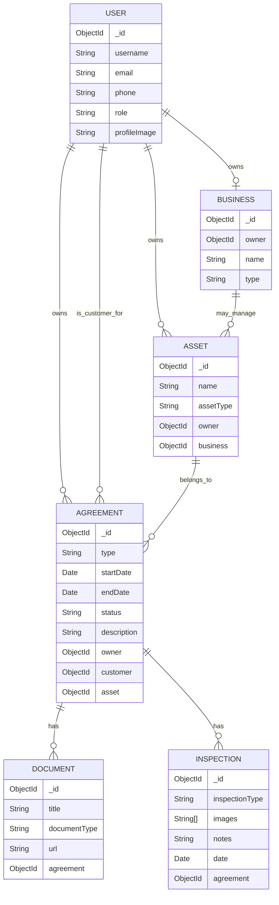

# Thiqah

Thiqah is a full-stack records-management application for customers, business owners, and administrators. It helps users keep agreements, assets, documents, and property-inspection records organized in one place.

Customers can manage their own agreements and documents. Owners can create agreements for customers, view their agreement records, and add a property inspection when creating a property agreement. Administrators can manage users and businesses.

## Repositories

- [Frontend Repository](https://github.com/HusainAlmajed/Project-4-FrontEnd)
- [Backend Repository](https://github.com/HusainAlmajed/Project-4-BackEnd)

## Features

### Authentication and Profiles

- Customer and owner sign-up
- Sign-in using JWT authentication
- Role-based customer, owner, and admin dashboards
- View and edit user profile information
- Upload a profile image with Cloudinary

### Agreements and Assets

- Create agreements with an associated asset
- Agreement status is calculated as `active`, `expiring soon`, or `expired`
- View agreement details
- Edit and delete agreements
- Customer agreement list
- Owner agreement list
- Owner dashboard with customer-phone search

### Documents

- Add a required document while creating an agreement
- View documents linked to an agreement
- Open a document URL in a new browser tab
- Edit and delete documents

### Property Inspections

- Owners can add inspection information when creating a property agreement
- Before and after inspection types
- Upload and preview property-inspection images with Cloudinary
- Store inspection notes and inspection date

### Admin Dashboard

- View users
- Change user roles
- Delete users
- View businesses
- Delete businesses

## ERD



## Technologies Used

### Frontend

- React
- React Router
- JavaScript
- HTML
- CSS
- Vite
- ESLint
- Cloudinary Upload Widget

### Backend

- Node.js
- Express
- MongoDB
- Mongoose
- JSON Web Tokens
- bcrypt

## Getting Started

### 1. Clone the Repository

```bash
git clone https://github.com/HusainAlmajed/Project-4-FrontEnd.git
```

### 2. Move Into the Project Directory

```bash
cd Project-4-FrontEnd
```

### 3. Install Dependencies

```bash
npm install
```

### 4. Create an Environment File

Create a `.env` file in the project root:

```env
VITE_BACK_END_SERVER_URL=http://localhost:3000
```

Replace the local URL with the deployed backend URL when deploying the application.

### 5. Start the Development Server

```bash
npm run dev
```

To create a production build:

```bash
npm run build
```

## Project Structure

```text
src/
├── assets/
├── components/
│   ├── Nav.jsx
│   └── UploadWidget.jsx
├── pages/
│   ├── AdminDashboard.jsx
│   ├── AgreementDetails.jsx
│   ├── AgreementForm.jsx
│   ├── AgreementList.jsx
│   ├── CostumerAgreement.jsx
│   ├── DashboardCostumer.jsx
│   ├── DocumentForm.jsx
│   ├── DocumentList.jsx
│   ├── OwnerDashboard.jsx
│   ├── SignIn.jsx
│   └── UserProfile.jsx
├── services/
│   ├── admin.js
│   ├── agreement.js
│   ├── authServices.js
│   ├── business.js
│   ├── document.js
│   └── inspection.js
├── App.jsx
├── App.css
├── index.css
└── main.jsx
```

## Future Enhancements

- Dedicated property-inspection list and details pages
- Reminder notifications for expiring agreements
- More detailed document and inspection permissions
- Search and filtering for customer agreements
- Improved responsive styling and UI polish

## Developers

- [Zuhair05](https://github.com/Zuhair05)
- [jonykadhem](https://github.com/jonykadhem)
- [HusainAlmajed](https://github.com/HusainAlmajed)

Thiqah was developed as a collaborative full-stack MERN project.